# 🚗 Fastdrink PiCar Global

Ce projet utilise un Raspberry Pi avec un kit PiCar pour créer une voiture autonome programmable.

## 📋 Table des matières

- [⚡ Alimentation](#-alimentation)
- [🌐 Connexion SSH](#-connexion-ssh)
- [🔧 Configuration VSCode Remote](#-configuration-vscode-remote)
- [⚙️ Calibration du PiCar](#️-calibration-du-picar)
- [🐍 Utilisation de PiCarFunctions.py](#-utilisation-de-picarfunctionspy)
- [🌐 Contrôle via Web App](#-contrôle-via-web-app)
- [💻 Commandes utiles](#-commandes-utiles)
- [⚠️ Problèmes courants](#️-problèmes-courants)
- [🔌 Arrêt du PiCar](#-arrêt-du-picar)

---

## ⚡ Alimentation

### 🔋 Alimentation par batteries

Le PiCar peut être alimenté de deux façons différentes.

**Option 1 : Alimentation par batteries**

Activez l'interrupteur pour alimenter le système via les batteries :

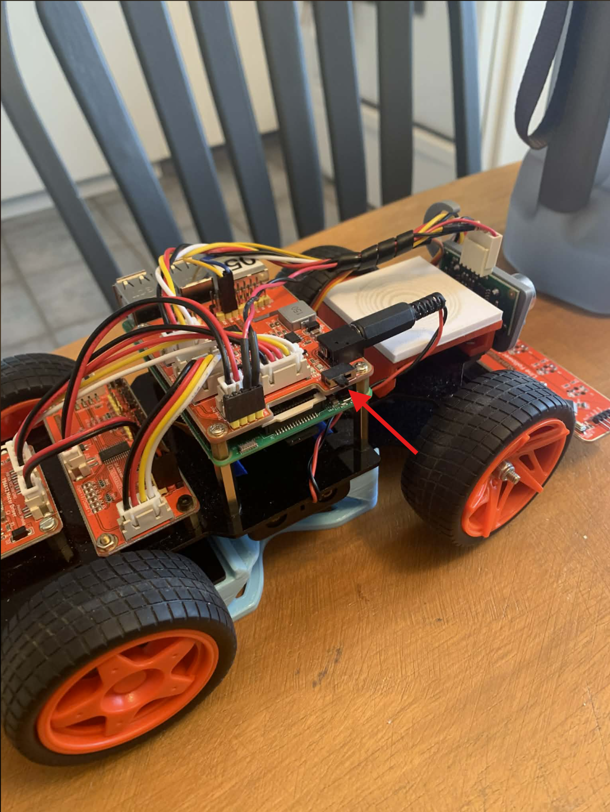

> ℹ️ **Note** : Le circuit supérieur connecte les batteries et tous les capteurs (sauf le détecteur de ligne) au Raspberry Pi.

### 🔌 Alimentation par câble USB-C

**Option 2 : Alimentation directe par ordinateur**

Pour économiser les batteries, connectez directement le Pi à votre ordinateur :

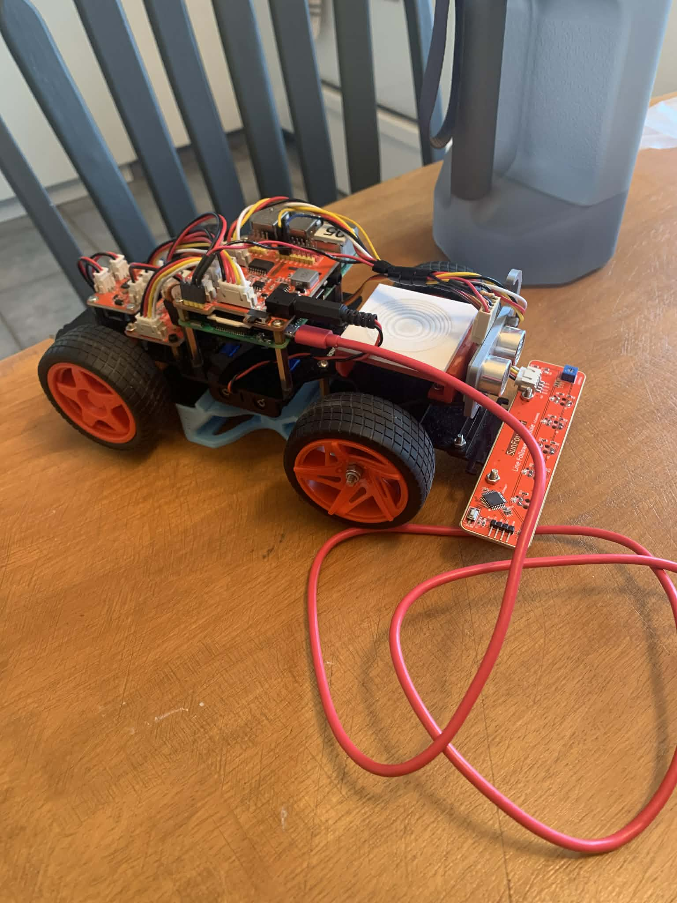

> ⚠️ **Important** : Avec cette méthode, le Pi sera alimenté (permettant la connexion SSH), mais les capteurs ne fonctionneront pas.

---


## 🌐 Connexion SSH

### 📍 Configuration réseau

#### 🏫 À l'école
- **Wi-Fi** : `ido`
- **Mot de passe** : `GEGI_devices_25$`
- **Adresse IP du Pi** : `10.160.226.139`

#### 🏠 À la maison
Connectez le Raspberry Pi à votre propre réseau Wi-Fi.

> ⚠️ **Important** : Votre ordinateur doit être connecté au même réseau Wi-Fi que le Raspberry Pi.

---

### 🔐 Identifiants de connexion

Le Raspberry Pi utilise les identifiants par défaut :
- **Nom d'utilisateur** : `pi`
- **Mot de passe** : `raspberry`

### 🖥️ Commandes de connexion

**1. Trouver l'adresse IP du Pi (vous devez connecter le pi à un moniteur):**


```bash
hostname -I
```

> ℹ️ pas nécessaire avec raspberrypi.local

**2. Se connecter via SSH par un terminal de votre ordinateur:**
```bash
ssh pi@<adresse_ip_du_pi>
```

ou

```bash
ssh pi@raspberrypi.local
```

**Exemple :**
```bash
ssh pi@10.160.226.139
```

> 💡 **Première connexion** : Tapez `yes` lorsque le terminal demande de confirmer la clé du serveur.

---

## 🔧 Configuration VSCode Remote SSH

### 📝 Étapes de connexion

**1. Ouvrir la palette de commandes VSCode :**
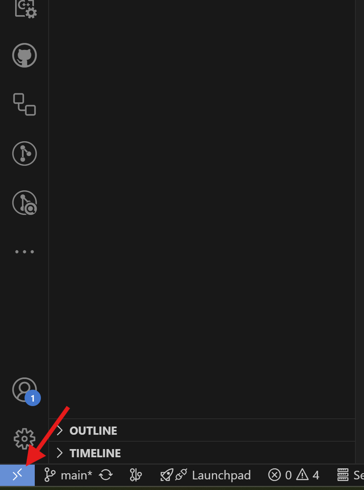

**2. Sélectionner "Remote-SSH: Connect to Host..." :**
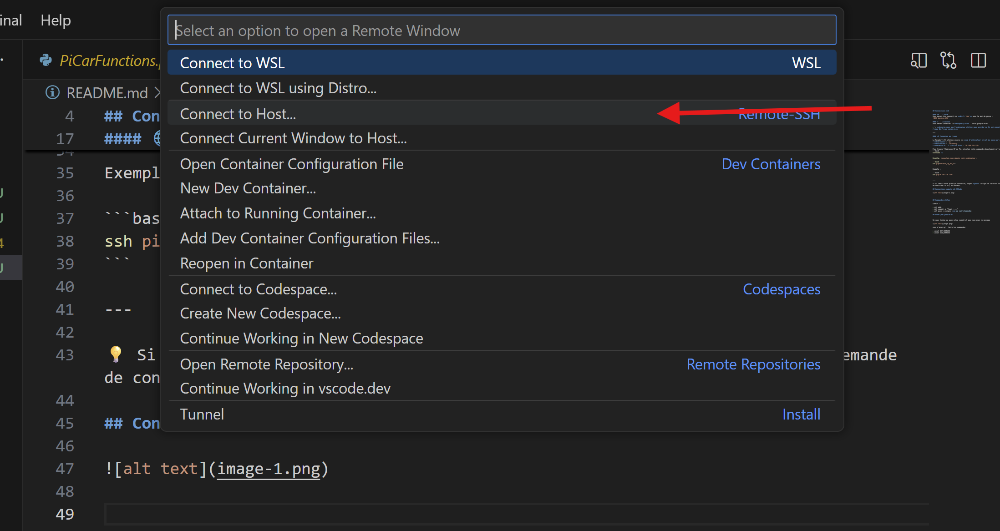

**3. Entrer l'adresse de connexion SSH :**
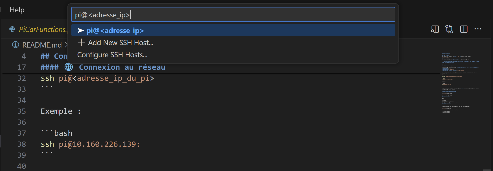

**4. Une fois connecté, ouvrir le dossier :**


**5. Naviguer vers le dossier Documents :**
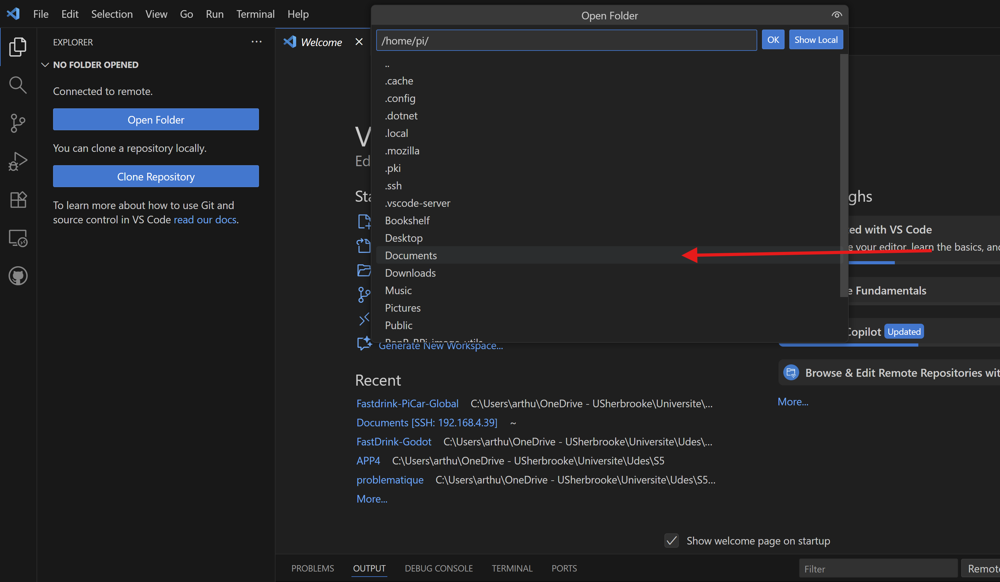

**6. Accéder à la racine du repository Git :**
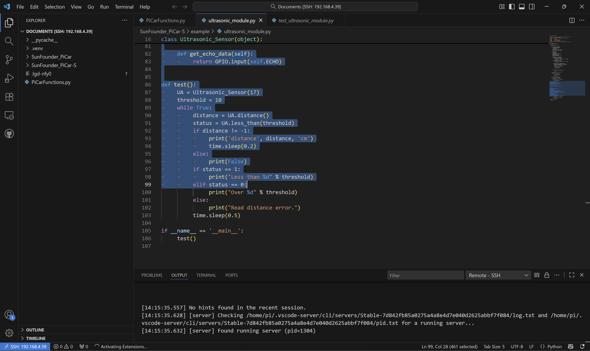

> ℹ️ **Info** : Une fois dans le dossier Documents, vous serez à la racine du repository Git.

### 🔑 Configuration des clés SSH (Optionnel)

Se connecter en SSH avec une clé SSH au lieu d'un mot de passe permet de réduire le temps de connexion et d'éviter les déconnexions fréquentes de VSCode Remote SSH.

> 💡 **Avantage** : VSCode Remote SSH se déconnecte environ toutes les 5 minutes, cette méthode évite de ressaisir constamment le mot de passe.

#### **1. Génération de la clé SSH**

```bash
ssh-keygen -t ed25519 -C "votre_email@exemple.com"
```

> ℹ️ **Conseil** : Appuyez sur `Entrée` pour chaque question (chemin et passphrase), sauf si vous souhaitez protéger la clé par un mot de passe local.

#### **2. Transfert de la clé vers le Raspberry Pi**

**🪟 Avec PowerShell (Windows) :**
```powershell
type $env:USERPROFILE\.ssh\id_ed25519.pub | ssh pi@<adresse_ip> "mkdir -p ~/.ssh && cat >> ~/.ssh/authorized_keys && chmod 700 ~/.ssh && chmod 600 ~/.ssh/authorized_keys"
```

**🐧 Avec Bash (Linux/macOS) :**
```bash
ssh-copy-id pi@<adresse_ip>
```

> ⚠️ **Important** : Remplacez `<adresse_ip>` par l'adresse IP réelle ou utilisez `raspberrypi.local`.

#### **3. Connexion sans mot de passe**

Une fois configurée, vous pourrez vous connecter sans saisir de mot de passe :

```bash
ssh pi@<adresse_ip>
```

**Exemple :**
```bash
ssh pi@raspberrypi.local
```
---

## ⚙️ Calibration du PiCar

### 📍 Prérequis

> ⚠️ **Important** : Ces commandes doivent être exécutées depuis la **racine du repository** sur le Raspberry Pi.

### 🔧 Procédure de calibration

La calibration du steering des roues avant est essentielle pour garantir un fonctionnement optimal du PiCar. Suivez ces étapes dans l'ordre :

#### **1. Démarrer Python interactif**

Depuis la racine du repository, lancez Python :

```bash
python3
```

#### **2. Importer les modules nécessaires**

```python
from SunFounder_PiCar.picar_local.SunFounder_PCA9685 import Servo
from SunFounder_PiCar.picar_local import filedb
from SunFounder_PiCar.picar_local.front_wheels import Front_Wheels
```

#### **3. Initialiser les roues avant**

```python
fw = Front_Wheels(channel=0)
```

> ℹ️ **Output attendu** : Vous devriez voir des messages de debug similaires à :
> ```
> DEBUG "front_wheels.py": Set debug off
> DEBUG "front_wheels.py": Set wheel debug off  
> DEBUG "Servo.py": Set debug off
> ```

#### **4. Effectuer la calibration**

**Position de calibration de base :**
```python
fw.calibration()
```

**Calibration vers la droite :**
```python
fw.cali_right()
# ou
fw.cali_left()
```
> ℹ️ Ceci incrémente le offset de base du steering

**Sauvegarder le offset**
```python
fw.cali_ok()
```
> ℹ️ Ceci sauvegarde le offset dans la bd au path ``/home/pi/Documents/SunFounder_PiCar/picar/config``


### 💡 **Conseils de calibration**

- 🎯 Vérifiez que les roues sont alignées après `cali_ok()`
- 🔄 Utilisez `cali_right()` pour ajuster la direction vers la droite si nécessaire
- 📏 La calibration peut nécessiter plusieurs essais pour obtenir un alignement parfait
- 🛑 Tapez `exit()` ou `Ctrl+D` pour quitter Python une fois terminé

### ⚠️ **Troubleshooting**

Si vous rencontrez des erreurs :
- Vérifiez que vous êtes bien dans la racine du repository
- Assurez-vous que l'alimentation est correctement branchée
- Redémarrez le Pi si les modules ne se chargent pas correctement

---

## 🐍 Utilisation de PiCarFunctions.py

### 📚 Description

Le fichier `PiCarFunctions.py` est un **mapper centralisé** qui regroupe toutes les fonctions des composants du PiCar dans un seul fichier pour faciliter leur utilisation.

### 🚀 Exécution des fonctions

**Syntaxe :**
```bash
python3 PiCarFunctions.py <nom_de_la_fonction>
```

**Exemple :**
```bash
python3 PiCarFunctions.py linedetector__test
```

### 📋 Fonctions disponibles

#### 🔍 **Détecteur de ligne**
| Fonction | Description |
|----------|-------------|
| `linedetector__get_data` | Récupère les données du détecteur de ligne |
| `linedetector__test` | Lance un test en continu du détecteur de ligne |

#### 📏 **Capteur de distance**
| Fonction | Description |
|----------|-------------|
| `distancesensor__get_data` | Récupère les données du capteur de distance |
| `distancesensor__test` | Lance un test en continu du capteur de distance |

#### 🚗 **Contrôles du PiCar - Moteurs**
| Fonction | Description |
|----------|-------------|
| `picarcontrols__forward` | Fait avancer le PiCar |
| `picarcontrols__backward` | Fait reculer le PiCar |
| `picarcontrols__set_wheels_speed` | Définit la vitesse des deux roues |
| `picarcontrols__set_lw_speed` | Définit la vitesse de la roue gauche |
| `picarcontrols__set_rw_speed` | Définit la vitesse de la roue droite |
| `picarengine__test` | Lance un test complet des moteurs |

#### 🎯 **Contrôles du PiCar - Direction**
| Fonction | Description |
|----------|-------------|
| `picarcontrols__steer` | Tourne les roues avant (angle en paramètre) |
| `picarcontrols__reset_steer` | Remet les roues droites |
| `picarsteering__test` | Lance un test de direction |

### 💡 **Exemples d'utilisation**

```bash
# Tester le détecteur de ligne
python3 PiCarFunctions.py linedetector__test

# Tester le capteur de distance
python3 PiCarFunctions.py distancesensor__test

# Tester les moteurs
python3 PiCarFunctions.py picarengine__test

# Tester la direction
python3 PiCarFunctions.py picarsteering__test
```

---

## 🌐 Contrôle via Web App

### 🚀 Démarrage du serveur API

Pour contrôler le PiCar via une interface web au lieu des commandes terminal, lancez le serveur API depuis la racine du projet :

```bash
python3 PiCarRoutes.py
```

Le serveur sera disponible sur :
- **Local** : `http://localhost:5000`
- **Réseau** : `http://<adresse_ip_du_pi>:5000`

> 💡 **Astuce** : Pour connaître l'IP de votre Pi, utilisez `hostname -I` ou `ip addr show`.

### 📋 API Endpoints disponibles

#### **🔍 Informations générales**
- `GET /picar/ping` - Test de connexion
- `GET /picar/get_all_data` - Récupère toutes les données des capteurs

#### **📏 Capteur de distance**
- `GET /picar/distancesensor/get_data` - Lecture du capteur de distance
- `GET /picar/distancesensor/is_obstacle_detected` - Détection d'obstacle
- `POST /picar/distancesensor/test` - Test du capteur (arrière-plan)

#### **🔍 Détecteur de ligne**
- `GET /picar/linedetector/get_data` - Lecture du détecteur de ligne
- `POST /picar/linedetector/test` - Test du détecteur (arrière-plan)

#### **🚗 Contrôle des moteurs**
- `POST /picar/engines/forward` - Avancer
- `POST /picar/engines/backward` - Reculer
- `POST /picar/engines/stop` - Arrêter les moteurs
- `POST /picar/engines/set_wheels_speed/<speed>` - Vitesse des deux roues (0-100)
- `POST /picar/engines/set_lw_speed/<speed>` - Vitesse roue gauche
- `POST /picar/engines/set_rw_speed/<speed>` - Vitesse roue droite
- `POST /picar/engines/test` - Test des moteurs (arrière-plan)

#### **🎯 Contrôle de direction**
- `POST /picar/steering/steer/<angle>` - Tourner (angle en degrés)
- `POST /picar/steering/reset_steer` - Remettre droit
- `POST /picar/steering/cali_left` - Calibrer à gauche
- `POST /picar/steering/cali_right` - Calibrer à droite
- `POST /picar/steering/test` - Test de direction (arrière-plan)

#### 💡 Exemples d'utilisation API

**Faire avancer le PiCar :**
```bash
curl -X POST http://localhost:5000/picar/engines/forward
```

**Définir la vitesse :**
```bash
curl -X POST http://localhost:5000/picar/engines/set_wheels_speed/50
```

**Tourner à gauche :**
```bash
curl -X POST http://localhost:5000/picar/steering/steer/-15
```

**Récupérer toutes les données :**
```bash
curl http://localhost:5000/picar/get_all_data
```

---

### 🎮 Interface Web de Contrôle

Pour une expérience utilisateur amélioré, utilisez l'application web de contrôle :

**🔗 [Fastdrink PiCar WebControl App](https://github.com/Les-Garcons-FastDrink/Fastdrink-PiCar-WebControlApp)**

Cette application web offre :
- ✅ Interface graphique intuitive
- ✅ Contrôle en temps réel du PiCar
- ✅ Visualisation des données des capteurs
- ✅ Contrôle à distance via le réseau
- ✅ Fonctions de calibration intégrées


## 💻 Commandes utiles

> ℹ️ Les étapes qui suivent spécifie les commandes à faire **dans le terminal du rapsberry pi**

### 📝 Commandes Git

**Faire un commit complet :**
```bash
git add .
git commit -m "feat: description des changements"
git push -u origin <nom_de_votre_branche>
```

---

## ⚠️ Problèmes courants


### 🔐 Problème d'authentification Git

Si vous obtenez une erreur lors du push comme illustré ci-dessous :

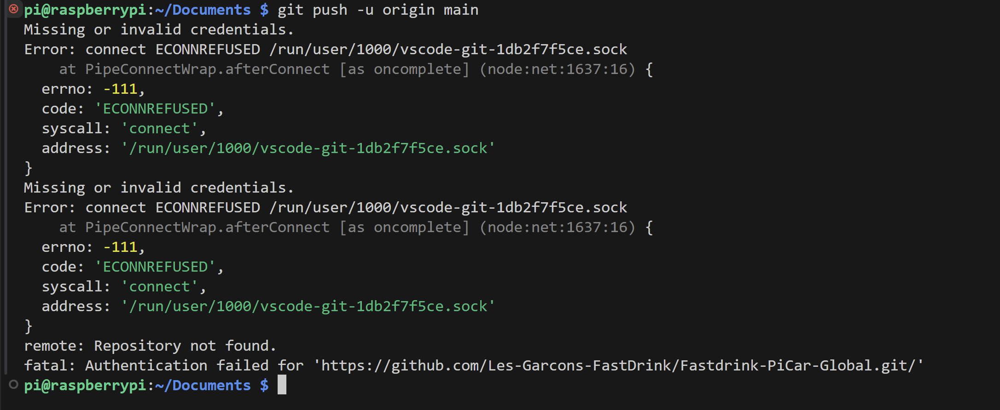

**Solution :**
```bash
unset GIT_ASKPASS
unset SSH_ASKPASS
```

### 🔄 Problème de connexion VSCode Remote SSH

Si VSCode Remote SSH tente de se connecter indéfiniment (demande répétée du mot de passe ou connexion infinie) :

**Solution :**
```bash
rm -rf ~/.vscode-server ~/.vscode-remote
```

Vous pourrez ensuite vous reconnecter via VSCode Remote SSH.

---

## 🔌 Arrêt du PiCar

> ⚠️ **IMPORTANT** : Vous devez **toujours** arrêter proprement le Raspberry Pi avant d'éteindre l'interrupteur du PiCar.

### 💻 Méthodes d'arrêt

#### 🖥️ Via SSH
```bash
sudo shutdown -h now
```

#### 🖱️ Via l'interface graphique
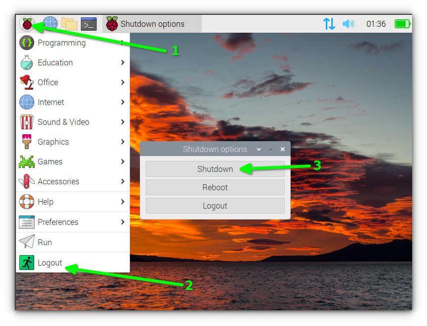

### 🚦 Indicateurs LED

#### 🟢 Raspberry Pi en fonctionnement
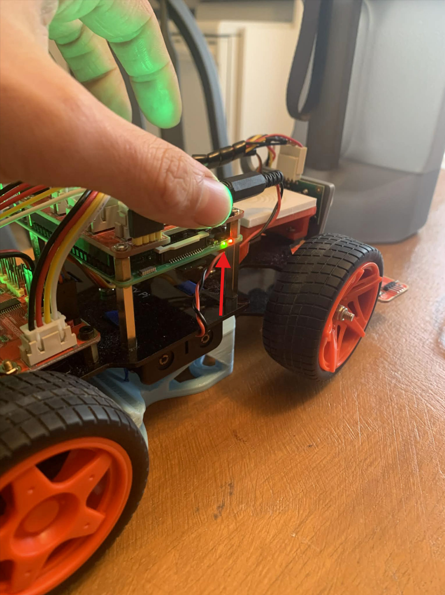
> La LED verte est allumée ou clignote.

#### 🔴 Raspberry Pi arrêté
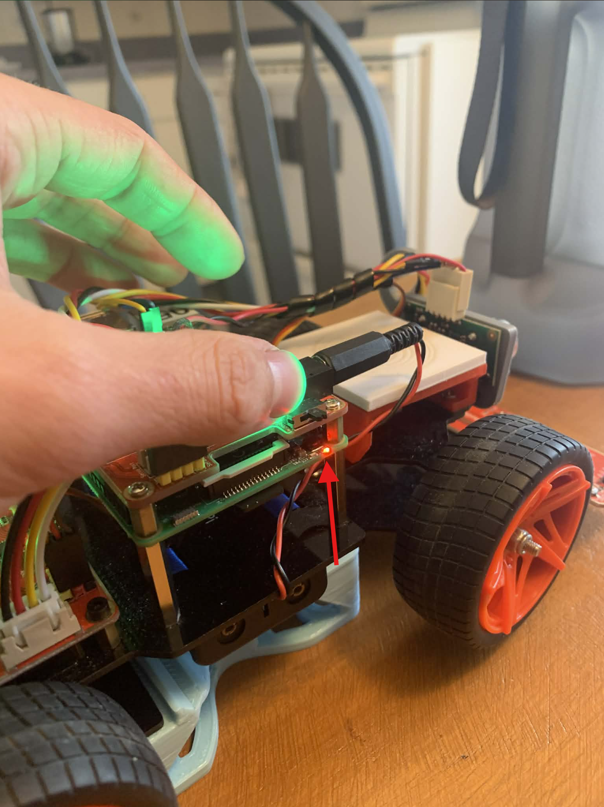
> Seule la LED rouge est allumée. **Vous pouvez maintenant débrancher le PiCar en toute sécurité.**

### ℹ️ Explication technique

Le Raspberry Pi peut être alimenté de deux façons :
- Via la connexion USB-C
- Via la broche VSYS (batteries dans notre cas)

Il est crucial d'arrêter proprement le système avant de couper l'alimentation par les broches, car cela peut interrompre les processus en cours et corrompre le système de fichiers. 